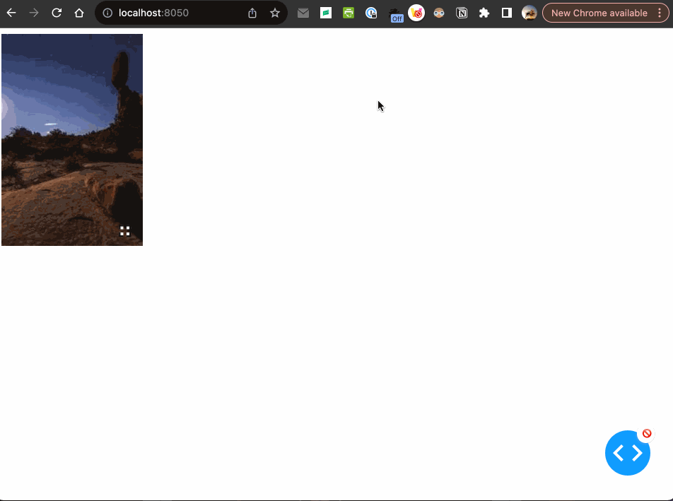

# Dash Modalable

Dash Modalable converts any content into a pop-up Modal, generally suitable for image or chart enlargement (note that the popped-up content and the original content are not the same, be careful to avoid ID conflicts).

Get started with:
1. Install Dash and its dependencies: https://dash.plotly.com/installation
2. Run `python usage.py`
3. Visit http://localhost:8050 in your web browser

## Usage

```python
import dash_modalable
from dash import Dash, html

app = Dash(__name__)

app.layout = html.Div([
    dash_modalable.DashModalable(
        children=html.Img(src='https://picsum.photos/200/300'),
        modalChildren=html.Img(src='https://picsum.photos/400/600'),
        modalZoomable=True,
        style={'width': '200px', 'height': '300px'}
    ),
])

if __name__ == '__main__':
    app.run_server(debug=True)
```



## Contributing

See [CONTRIBUTING.md](./CONTRIBUTING.md)

### Install dependencies

If you have selected install_dependencies during the prompt, you can skip this part.

1. Install npm packages
    ```
    $ npm install
    ```
2. Create a virtual env and activate.
    ```
    $ virtualenv venv
    $ . venv/bin/activate
    ```
    _Note: venv\Scripts\activate for windows_

3. Install python packages required to build components.
    ```
    $ pip install -r requirements.txt
    ```
4. Install the python packages for testing (optional)
    ```
    $ pip install -r tests/requirements.txt
    ```

### Write your component code in `src/lib/components/DashModalable.react.js`.

- The demo app is in `src/demo` and you will import your example component code into your demo app.
- Test your code in a Python environment:
    1. Build your code
        ```
        $ npm run build
        ```
    2. Run and modify the `usage.py` sample dash app:
        ```
        $ python usage.py
        ```
- Write tests for your component.
    - A sample test is available in `tests/test_usage.py`, it will load `usage.py` and you can then automate interactions with selenium.
    - Run the tests with `$ pytest tests`.
    - The Dash team uses these types of integration tests extensively. Browse the Dash component code on GitHub for more examples of testing (e.g. https://github.com/plotly/dash-core-components)
- Add custom styles to your component by putting your custom CSS files into your distribution folder (`dash_modalable`).
    - Make sure that they are referenced in `MANIFEST.in` so that they get properly included when you're ready to publish your component.
    - Make sure the stylesheets are added to the `_css_dist` dict in `dash_modalable/__init__.py` so dash will serve them automatically when the component suite is requested.
- [Review your code](./review_checklist.md)

### Create a production build and publish:

1. Build your code:
    ```
    $ npm run build
    ```
2. Create a Python distribution
    ```
    $ python setup.py sdist bdist_wheel
    ```
    This will create source and wheel distribution in the generated the `dist/` folder.
    See [PyPA](https://packaging.python.org/guides/distributing-packages-using-setuptools/#packaging-your-project)
    for more information.

3. Test your tarball by copying it into a new environment and installing it locally:
    ```
    $ pip install dash_modalable-0.0.1.tar.gz
    ```

4. If it works, then you can publish the component to NPM and PyPI:
    1. Publish on PyPI
        ```
        $ twine upload dist/*
        ```
    2. Cleanup the dist folder (optional)
        ```
        $ rm -rf dist
        ```
    3. Publish on NPM (Optional if chosen False in `publish_on_npm`)
        ```
        $ npm publish
        ```
        _Publishing your component to NPM will make the JavaScript bundles available on the unpkg CDN. By default, Dash serves the component library's CSS and JS locally, but if you choose to publish the package to NPM you can set `serve_locally` to `False` and you may see faster load times._

5. Share your component with the community! https://community.plotly.com/c/dash
    1. Publish this repository to GitHub
    2. Tag your GitHub repository with the plotly-dash tag so that it appears here: https://github.com/topics/plotly-dash
    3. Create a post in the Dash community forum: https://community.plotly.com/c/dash
